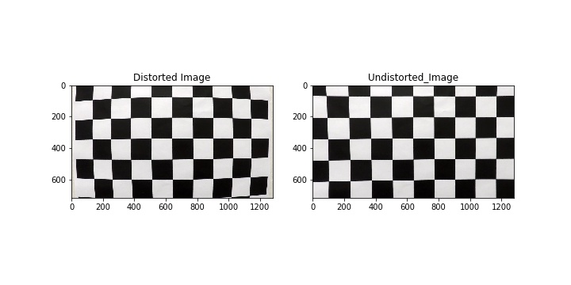

# Advanced_lane_finding

The goal of this project is to provide pipeline for the lane detection on the road by using the camera mounted in front of the vehicle.

The steps for processing image is as follows

1. Camera Calibration and applying distortion using matrinx and distortion coefficients
 
 
 
 
 
  Camera Calibration is done by using different chessboard test images. The chessboard is of 9*6 size. The corners of the chessboard is found using the opencv findchessboardcorners. 
  Using the output of the above function (objectpoints, imagepoints) the corners is drawn on the chessboard for crosschecking purpose as well as it used to calibrate the camera which will be useful undistorting the image
  
  Using the output of the calibratecamera function of opencv library we get the matrix and distortion coefficients. Using this we undistort the image using opencv cv2.undistort function. 
  
  
2. Perspective Transform to wrap the image into Bird's Eye View
  
  The undistorted image is then is transformed in to the bird's eye view of the road image. The purpose of using the birds eye here is that it wholly concentrates on the lane lines which help us reduce noise during thresholding.The funtion of perspective transfrom takes two inputs i.e coordinates of the source images and coordiantes of the destination images. Also the inverse transform is also used to which will be later for unwrapping the image. The ouput of the perspective transform function is fed to wrap perspective function along with image and image size for getting the output as we need.
  
  
3. Apply Binary Threshold using different color spaces and gradients
  
  This step helps to detect the lines more precisely using different gradient and color spaces.
  Here I used the BGR and HLS color spaces. The gradient were taken for both x and y along with the directional and magnitude gradient threshold. In the HLS color space, H channel has threshold between (10,100), L channel has threshold between (10,60) and S channel has threshold between (85,255). I combined the output of both the above threshold and got the binary image for the further processing
  
4. Finding Lane Lines and its display
  
  Here, the goal was to fit the polynomial to each line. First the histogram of each image is used to determine the lane line.
  After that, all the nonzero points were identified using the numpy function and the polynomial is fitted using the numpy.A class Lane was build to store the values of lane lines, radius of curvature, lane detection, previous points and y points. This class helped to keep track of the previous lane lines and the radius of curvature.The image display is done along with the metrics on the left side of the image.
  
5.Pipeline
  A class Pipeline is defined fot the smooth operation of the process. The pipeline undistorts the image frame by frame and wraps its according to given cooradinate. The binary image output is given to the lane finding function to find out the lanes. The lane finding fucntion has a code to detect is previous line were found or not in the previous image. It helps to connect the lines more precisly. Also the metrics are displayed on the image of left lane and right lane curvature. A object is intiated using the lane class for keeping the details of the lanes (right,left) which is given as input for lane finding purpose. This class helps to store the calculations of the respective lane lines.

  

Limitations
  The pipeline did a fair job in detecting the lines for the test image and video. But the problem arises when there are different shaded on the road like shadow of objects.I did try using the different threshold but i was not getting any optimal solution for the problem. I have learned a lot from this project by using different thresholding techniques, color spaces, lane detection techniques. The pipeline did not work as expected on the harder video challenge. The harder video challenge has different shades of color on the road due to the shadows.
  
  
  
